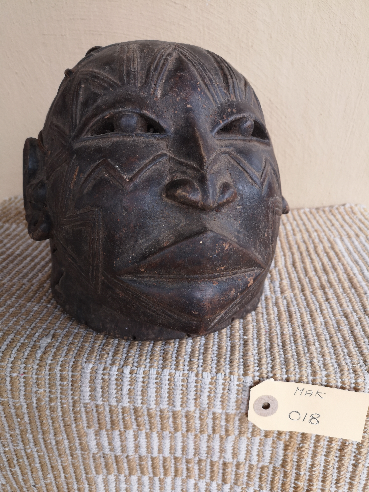

# Makonde Helmelt Mask 
**Catalogue ID:** MAK018

---

## Classification
- **Object Type:** Helmelt Mask 
- **Category:** Ritual Object - Initiation for boys 

---

## Origin
- **Country:** Mozambique 
- **Ethnicity:** Makonde
- **Region:** Northen Mozambique 

---

## Physical Attributes

### Materials
- Wood  
- Scarification on face, in accord with traditional patterns, indigenous repair 

### Dimensions
- **Height:** [X] cm  
- **Width:** [X] cm  
- **Depth:** [X] cm  

### Estimated Age
- Mid +- 1950

### Adornments
- [Adornments]

### Condition
-  Good, with obvious ware from use.

---

## Media

### Primary Image

### Additional Images

---

## Description

### Summary
These the top of mask were just part of a complete costume tied to the base of the mask through the holes and we used in the ending of the initiation ceremony for boys.

### Detailed Description
these the top of mask were just part of a complete costume tied to the base of the mask through the holes and we used in the ending of the initiation ceremony for boys. Mask was used and made, in accordance with to imitate a person. This perticuliar mask Markonde, Mapiko often associated with the devil. 

---

## Provenance
- **Acquisition Date:** Early 2000
- **Acquisition Location:** Johannesburg 
- **Acquired From:** Art trader / dealer.
- **Ownership History:** S. Lifschitz  

---

## Collector Narrative

### Title
[Title]

### Story
[Story]

---

## Cultural Context
- **Detailed Significance:** Ceremonial
- **Detailed Functional:** Ceremonial ritual item for initiation.  
- **Related References:** Holy.L Masks and Figures from Eastern and Southern Africa. Publication date: January 1, 1967 ASIN: B0006BXQEK 

---

## Catalogue Metadata

### Keywords
- Makonde  
- Mask  
- Ritual  
- Mozambique  
- Shamanic Collection  

### Created Date
17 September 2026

### Last Updated
[Date]
