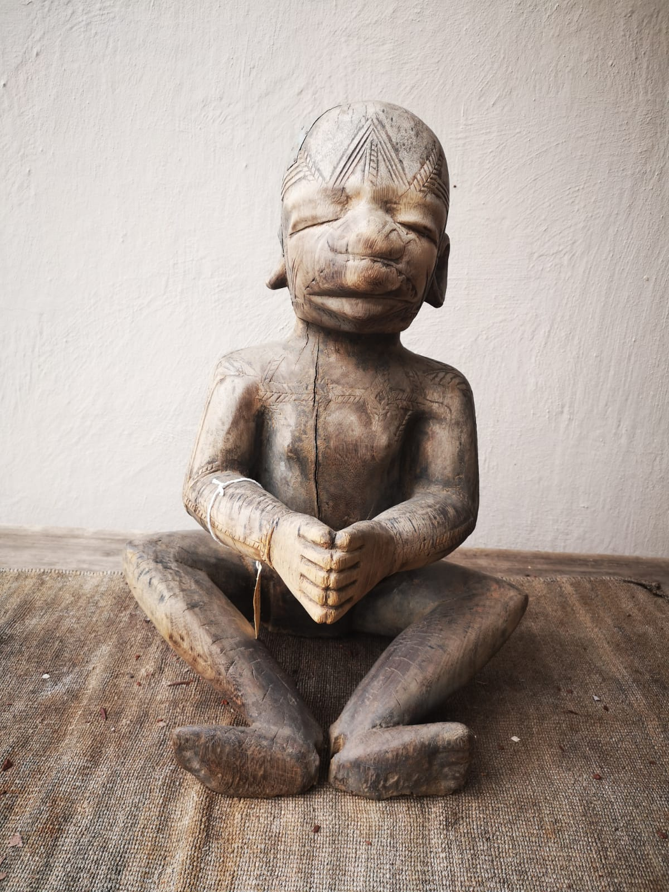

**Catalogue ID:** MAK026

---
## Classification
- **Object Type:** Altar Figure   
- **Category:** Ritual Object  
---

## Origin
- **Country:** Tanzania  
- **Ethnicity:** Makonde  
- **Region:** Southern Tanzania

---

## Physical Attributes

### Materials
- Wood  
- Scarification on face and body, repair with aluminium strips on the head

### Dimensions
- **Height:** 58 cm  
- **Width:** 38 cm  
- **Depth:** 

### Estimated Age
- Mid 1900 

### Adornments
- Not specified 

### Condition
- Worn, evidence of use. 

---

## Media

### Primary Image

### Additional Images
[3D Model](https://lumalabs.ai/capture/116D37F6-B2AB-4043-8AA9-72F5B8CF68F9)
---

## Description
### Summary
A Makondi altar figure likely used in healing ceremonies, originating from southern Tanzania but showing scarification patterns associated with northern Mozambique. The figure once held an unknown protruding element and displays notable age and a striking, unsettling posture.

### Detailed Description

This piece is an altar figure, it is or might be one of many or other pieces which are used in ceremonies of healing it derives from southern Tanzania even though the scarifications and markings correspond to those used in northern Mozambique amongst the Makonde people there is a place in which some sort of rod or protrusion was placed which is absent and unknown exactly what it was the piece shows where in age and has a pose which to my experience is a bit disturbing.

<!--
This piece is an altar figure it is might it may be one of many or other pieces which are used in ceremonies of healing it derives from southern Tanzania even though the scarifications and markings correspond to those used in northern Mozambique amongst the Makonde people there is a place in which some sort of rod or protrusion was placed which is absent and unknown exactly what it was the piece shows where in age and has a pose which to my experience is a bit disturbing
-->

---

## Provenance
- **Acquisition Date:** Early 2000
- **Acquisition Location:** Johannesburg 
- **Acquired From:** Mozambican art trader / dealer.
- **Ownership History:** S. Lifschitz 

---

## Collector Narrative

### Title
- Not specified 

### Story
- Not specified 
---

## Cultural Context
- **Detailed Significance:** Ceremonial
- **Detailed Functional:** Ceremonial ritual item for healing.
- **Related References:** Holy.L Masks and Figures from Eastern and Southern Africa. Publication date: January 1, 1967 ASIN: B0006BXQEK

---

## Catalogue Metadata

### Keywords
- Makonde  
- Statue  
- Ritual  
- Tanzania  
- Shamanic Collection  

### Created Date
15 September 2026

### Last Updated
Not specified
