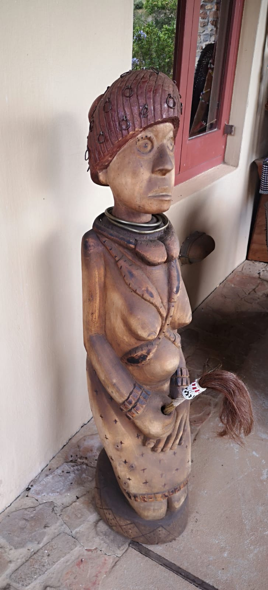
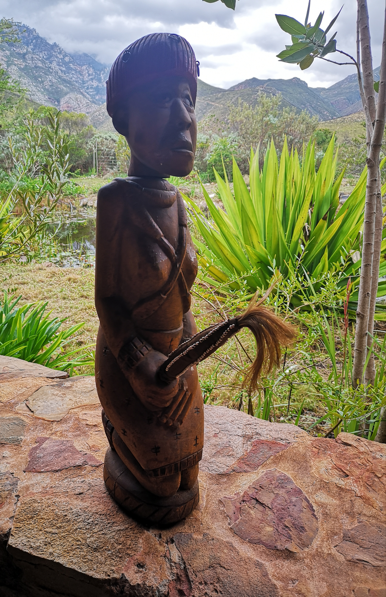

**Catalogue ID:** TS-SA-044
---

## Classification
- **Object Type:** Figure 
- **Category:** Art piece   

---

## Origin
- **Country:** South Africa
- **Ethnicity:** Shangaan 
- **Region:** Giyani

---

## Physical Attributes

### Materials
- Wood
- Painted

### Dimensions
- **Height:** [110] cm  
- **Width:** [X] cm  
- **Depth:** [X] cm  

### Estimated Age
-  1990

### Adornments
- Traditional Sangomo outfit and holding a detaachable shoba (Commonaly known as a fly wisp)

### Condition
- Good

---

## Media

### Primary Image

### Additional Images

---

## Description

### Summary
Sangoma in a traditional kneeling pose holding a shobha by Johannes Maswanganyi

### Detailed Description
This piece was made by Johannes Maswanganyi as one of numerous pieces he made of different sizes showing the Sangoma in a traditional kneeling pose holding a shobha at the back of the head on the decorations not in view of the the photograph is a a form which is that of the bladder from a sacrificed goat
---

## Provenance
- **Acquisition Date:** 1990s 
- **Acquisition Location:** Pretoria 
- **Acquired From:** Artist  
- **Ownership History:** S. Lifschitz 

---

## Collector Narrative

### Title
[Title]

### Story
[Story]

---

## Cultural Context
- **Detailed Significance:** Art sculpture, displays Songoma in traditional pose.  
- **Detailed Functional:** [Function]  
- **Related References:** [References]  

---

## Catalogue Metadata

### Keywords
- Songoma 
- Art  
- Figure

### Created Date
17 Spetember 2026

### Last Updated
[Date]
